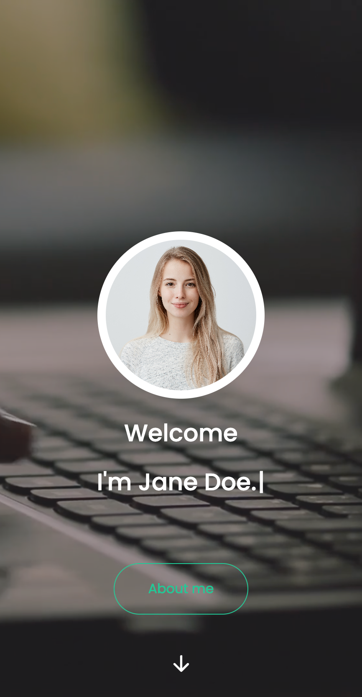

# Portfolio React App

Welcome to my portfolio website crafted with simplicity and engagement in mind. Using React.js and SCSS, I've created a space where you can seamlessly explore projects.

## Project Overview

This portfolio site is designed to be simple yet engaging. With React.js and SCSS, I've crafted a space where you can explore projects easily. Whether you're browsing in light or dark mode, the site adapts to your preference and is fully responsive. You're welcome to apply this portfolio to showcase your own work. Thank you for considering it!

## Screenshots

Here are a couple of screenshots from my project:

  

## Technologies Used

Here's what powers this portfolio:

- React.js: Bringing interactivity and smooth navigation.
- SCSS: Adding style and flexibility.
- Email-js npm package: Facilitating seamless communication.

### Links

Feel free to make this portfolio your own:

- git clone : https://github.com/Sumeyye-Mete/music-player-app.git
- live site URL : https://mete-music-app.netlify.app
